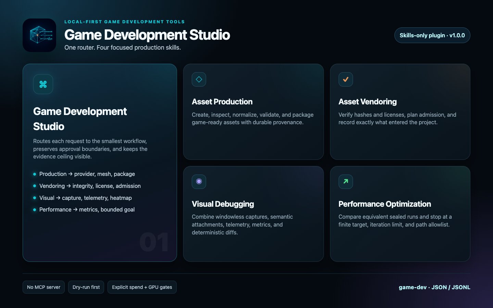
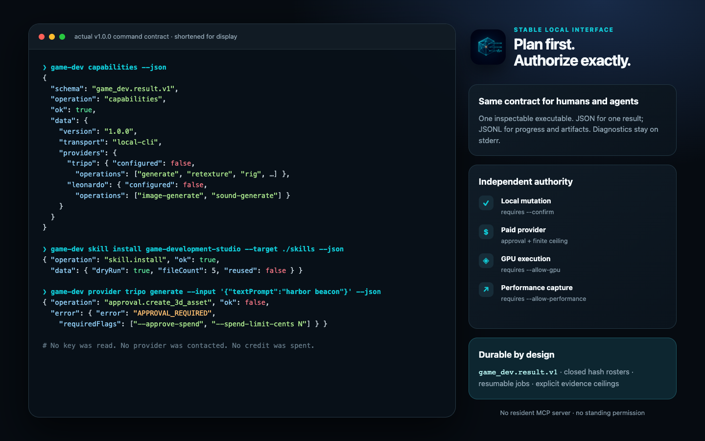
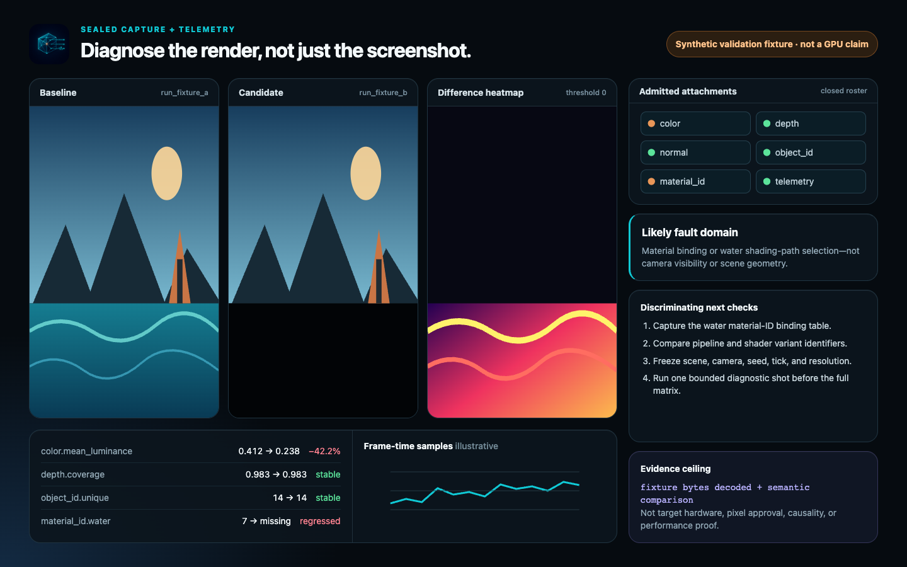

<p align="center">
  
</p>

# Game Development Studio

Local-first tools for producing, packaging, vendoring, capturing, debugging,
and optimizing game assets and renders. The stable interface is the
`game-dev` command-line program and its JSON/JSONL protocol. No MCP server is
required.

The project is designed for human developers and local coding agents that need
more than a screenshot: immutable run bundles can combine render attachments,
scene controls, logs, counters, timing samples, and provenance so a visual
diagnosis has inspectable evidence behind it.

## What it does

- Drives Tripo 3D and Leonardo image/audio jobs through explicit,
  per-invocation spend authorization.
- Inspects and validates GLB assets, normalizes meshes through Blender, and
  creates optional USDZ previews.
- Builds content-addressed asset packages with hashes, receipts, provenance,
  licenses, validation results, and a rebuildable catalog.
- Plans project vendoring before it writes and blocks unknown licenses,
  invalid packages, symlink escapes, and destination collisions by default.
- Runs declarative, project-owned capture scenarios with independent
  authorizations for execution, GPU use, and hardware-performance collection.
- Seals render outputs, semantic attachments, telemetry, logs, and metrics into
  verifiable run bundles.
- Computes deterministic raster statistics, heatmaps, attachment-aware
  comparisons, metric summaries, and bounded optimization goals.
- Ships a router and four focused Codex/ChatGPT skills without automatically
  installing anything into a user profile.

## Requirements

- Node.js 22.5 or newer
- macOS, Linux, or Windows for the CLI
- Blender only for normalization or Blender-backed preview workflows
- Tripo or Leonardo credentials only for the corresponding paid provider
  operations
- A project adapter only when executing game-specific capture scenarios

The native macOS 26 companion app is a separate, last-stage deliverable. It is
not required by the CLI or skills.

## Product tour







The third image is explicitly a synthetic validation fixture. It demonstrates
the diagnostic layout and evidence language; it is not a target-game capture,
hardware GPU result, or performance claim.

## Install

From a published npm release:

```sh
npm install --global @theisegoria/game-development-studio
game-dev --version
```

From source:

```sh
git clone https://github.com/theisegoria/game-development-studio.git
cd game-development-studio
npm ci
npm run build
node dist/cli.js --help
```

No provider call is made during installation, build, test, `doctor`, or
`capabilities`.

## Quick start

Choose a workspace and inspect the local environment:

```sh
game-dev capabilities --output-dir ./asset-workspace --json
game-dev doctor --output-dir ./asset-workspace --json
game-dev credentials status --output-dir ./asset-workspace --json
```

Inspect an existing GLB without invoking Blender or a provider:

```sh
game-dev asset inspect ./model.glb --output-dir ./asset-workspace --json
game-dev asset validate ./model.glb --output-dir ./asset-workspace --json
```

Build and verify a canonical package:

```sh
game-dev package build ./model.glb \
  --name "Signal Beacon" \
  --version 1.0.0 \
  --license CC0-1.0 \
  --output-dir ./asset-workspace \
  --json

game-dev catalog list --output-dir ./asset-workspace --json
game-dev package verify PACKAGE_ID --output-dir ./asset-workspace --json
```

Project admission is dry-run-first:

```sh
game-dev vendor admit PACKAGE_ID --project /path/to/game --json
game-dev vendor admit PACKAGE_ID --project /path/to/game --confirm --json
```

The second command is a new invocation with explicit write authorization. A
plan does not become standing permission.

## Paid provider jobs

Credentials are read lazily from the environment and never accepted as command
arguments:

```sh
export TRIPO_API_KEY="..."
export LEONARDO_API_KEY="..."
```

Every paid invocation needs both approval and a finite estimated spend ceiling:

```sh
game-dev provider tripo generate \
  --request ./requests/prop.json \
  --approve-spend \
  --spend-limit-cents 100 \
  --output-dir ./asset-workspace \
  --jsonl
```

Supported provider routes are:

- Tripo: `generate`, `retexture`, `rig`, `retarget`, and
  `retopologize`
- Leonardo: `image-generate` and `sound-generate`

The ceiling is a refusal guard based on estimated prices, not a provider
invoice. Provider submission creates a durable local job before polling so an
interruption does not erase what was requested or what may have been charged.
Resuming a job requires fresh authorization.

## Capture harness

An adapter is a declarative `.game-dev/adapter.json` owned by the target game.
It names scenarios, commands, parameters, declared capabilities, and the run
output contract. Installing a template and inspecting an adapter do not execute
the game.

```sh
game-dev adapter templates --json
game-dev adapter install genome-game --project /path/to/game --json
game-dev adapter install genome-game --project /path/to/game --confirm --json
game-dev scenario list --project /path/to/game --json
game-dev scenario plan trident-bay-contract --project /path/to/game --json
```

Execution requires `--confirm`. A scenario that declares GPU or
hardware-performance capability additionally requires `--allow-gpu` or
`--allow-performance` for that invocation:

```sh
game-dev scenario run trident-bay-windowless-metal \
  --project /path/to/game \
  --request ./capture-parameters.json \
  --confirm \
  --allow-gpu \
  --jsonl
```

Once the adapter has produced its staging output, the harness validates the
closed artifact roster and hashes it into a sealed run bundle. Typical
attachments include color, depth, normals, object IDs, material IDs, motion,
and overdraw, but the adapter declares the exact set.

```sh
game-dev capture verify RUN_ID --json
game-dev visual analyze RUN_ID --json
game-dev visual compare BASELINE_RUN CANDIDATE_RUN \
  --threshold 0 \
  --output ./comparison \
  --jsonl
game-dev performance compare BASELINE_RUN CANDIDATE_RUN --stat median --json
```

See [Capture adapters](docs/adapters.md) for the manifest and output contract.

## Skill suite

The distribution contains five self-contained skills:

- `game-development-studio`: router and shared operating contract
- `game-asset-production`: provider, inspection, normalization, and packaging
- `game-asset-vendoring`: catalog, integrity, migration, and project admission
- `game-visual-debugging`: adapters, captures, telemetry, and raster evidence
- `game-performance-optimization`: metrics and bounded optimization goals

List the exact packaged bytes:

```sh
game-dev skill list --json
```

Installation is dry-run-first and refuses symlinked targets or drifted existing
copies:

```sh
game-dev skill install all --target /path/to/codex/skills --json
game-dev skill install all --target /path/to/codex/skills --confirm --json
```

Nothing in this repository installs into `~/.codex`, Genome, or another game
project without an explicit confirmed command. The standalone plugin source is
published separately at
[theisegoria/game-development-studio-skills](https://github.com/theisegoria/game-development-studio-skills).

## Machine-readable protocol

- `--json` emits exactly one `game_dev.result.v1` object to stdout.
- `--jsonl` emits ordered `game_dev.event.v1` records followed by one
  terminal result event.
- Logs and diagnostics go to stderr.
- Secrets are redacted from structured errors, receipts, jobs, and URLs.
- Persisted artifacts use atomic replacement and closed hash rosters where the
  format promises immutability.

Read [CLI protocol](docs/cli-protocol.md) before integrating the command with an
agent or GUI.

## Workspace layout

By default, `ASSET_OUTPUT_DIR` is `./assets/generated`; durable state is
under `$ASSET_OUTPUT_DIR/.game-dev`.

```text
assets/generated/
├── .jobs/                  legacy-compatible asset job records
└── .game-dev/
    ├── jobs/               durable provider operations
    ├── packages/           canonical game asset packages
    ├── runs/               sealed capture bundles
    └── catalog.sqlite3     rebuildable derived index
```

Set `GAME_DEV_DATA_ROOT` to place durable state elsewhere. See
[Asset packages](docs/asset-packages.md) and [Architecture](docs/architecture.md).

## Trust and evidence

Game Development Studio deliberately distinguishes evidence classes:

- Source inspection proves only what is present in source.
- Typecheck, unit, and contract tests prove those checks in the tested
  environment.
- Blender-backed tests prove the exercised headless Blender workflows.
- A valid capture bundle proves its declared files, hashes, controls, and
  adapter-reported telemetry.
- Only a real admitted run can support hardware GPU or performance claims.
- None of those automatically proves pixel correctness, causality, signing,
  notarization, or human visual approval.

Provider tests use local HTTPS fixtures and do not spend credits. Live-provider
acceptance, target-hardware captures, and human review remain separate gates.

## Development

```sh
npm ci
npm run typecheck
npm run lint
npm test
npm run verify
npm pack --dry-run --json
```

The full local suite may need permission to bind a loopback HTTPS fixture.
Blender-gated tests run when Blender is discoverable and are independently
enforced in CI.

See [Contributing](CONTRIBUTING.md), [Security](SECURITY.md),
[Privacy](PRIVACY.md), and [Terms](TERMS.md).

## License

MIT © 2026 Benjamin Michael Haire. Third-party providers, generated content,
source assets, and vendored assets remain subject to their own terms and
licenses.
